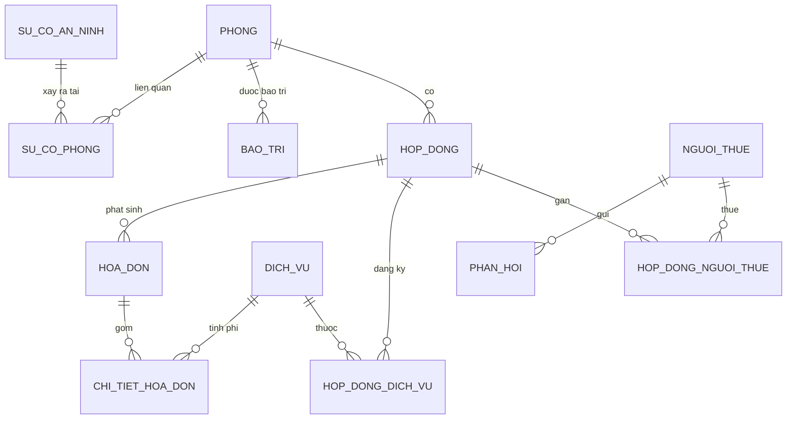

# TÀI LIỆU GIẢI THÍCH CƠ SỞ DỮ LIỆU
## Hệ thống Quản lý Phòng trọ / Ký túc xá (SQL Server – T-SQL)

> Tài liệu phân tích trên file `KTX_SqlServer.sql` (bản Microsoft SQL Server). Đây là bản dùng để demo môn Cơ sở dữ liệu: minh hoạ đầy đủ Stored Procedure, Trigger, Transaction và View. Mục tiêu của tài liệu: giúp sinh viên đọc xong là có thể tự tin bảo vệ đồ án.

---

## MỤC LỤC

1. [Tổng quan hệ thống](#1-tổng-quan-hệ-thống)
2. [Thiết kế cơ sở dữ liệu](#2-thiết-kế-cơ-sở-dữ-liệu)
   - 2.1 [Danh sách bảng](#21-danh-sách-bảng)
   - 2.2 [Chi tiết các cột](#22-chi-tiết-các-cột)
   - 2.3 [Khóa chính (Primary Key)](#23-khóa-chính-primary-key)
   - 2.4 [Khóa ngoại (Foreign Key)](#24-khóa-ngoại-foreign-key)
   - 2.5 [Quan hệ giữa các bảng](#25-quan-hệ-giữa-các-bảng)
3. [Phân tích từng câu lệnh SQL (tạo bảng & ràng buộc)](#3-phân-tích-từng-câu-lệnh-sql)
4. [Stored Procedure](#4-stored-procedure)
5. [Trigger](#5-trigger)
6. [Transaction](#6-transaction)
7. [View](#7-view)
8. [Function](#8-function)
9. [Các kỹ thuật SQL được sử dụng](#9-các-kỹ-thuật-sql-được-sử-dụng)
10. [Kịch bản Demo cho giảng viên](#10-kịch-bản-demo-cho-giảng-viên)
11. [Các câu hỏi bảo vệ đồ án](#11-các-câu-hỏi-bảo-vệ-đồ-án)
12. [Kết luận](#12-kết-luận)

---

## 1. TỔNG QUAN HỆ THỐNG

### Mục tiêu của hệ thống
Xây dựng một cơ sở dữ liệu quản lý hoạt động cho thuê phòng trọ / ký túc xá. Hệ thống lưu trữ thông tin phòng, khách thuê, hợp đồng, dịch vụ, hóa đơn và các nghiệp vụ phụ trợ (bảo trì, sự cố an ninh, nội quy, phản hồi). Database tự động hóa các quy tắc nghiệp vụ bằng **Trigger**, đảm bảo toàn vẹn dữ liệu bằng **Transaction**, đóng gói nghiệp vụ trong **Stored Procedure** và tổng hợp báo cáo bằng **View**.

### Bài toán đang giải quyết
Quản lý phòng trọ thủ công (sổ sách/Excel) dễ phát sinh sai sót: trạng thái phòng không khớp với thực tế, tính hóa đơn nhầm, không truy vết được lịch sử thao tác. Database này giải quyết bằng cách:
- **Chuẩn hóa dữ liệu** thành các bảng có quan hệ rõ ràng, tránh trùng lặp.
- **Ràng buộc toàn vẹn** (khóa chính, khóa ngoại, CHECK, UNIQUE) để dữ liệu luôn hợp lệ.
- **Tự động đồng bộ trạng thái** phòng khi có hợp đồng (Trigger).
- **Giao dịch an toàn** khi lập/thanh toán hóa đơn (Transaction: thành công trọn vẹn hoặc không thay đổi gì).
- **Ghi nhật ký thao tác** (bảng `AuditLog`) phục vụ kiểm tra, truy vết.

### Các chức năng chính
1. Quản lý phòng (thêm, sửa, xóa, theo dõi trạng thái: Trống / Đã thuê / Bảo trì).
2. Quản lý khách thuê (CCCD duy nhất).
3. Quản lý hợp đồng thuê và gắn nhiều khách / nhiều dịch vụ vào một hợp đồng.
4. Lập hóa đơn theo tháng, tự sinh chi tiết dịch vụ và tính tổng tiền.
5. Thanh toán hóa đơn và thống kê doanh thu.
6. Quản lý bảo trì, sự cố an ninh, nội quy, phản hồi của khách.
7. Báo cáo: phòng đang thuê, phòng trống, doanh thu theo tháng, công nợ khách thuê.

### Các đối tượng sử dụng
- **Quản trị viên / chủ trọ:** thao tác toàn bộ (CRUD phòng, khách, hợp đồng, hóa đơn, xem báo cáo).
- **Nhân viên quản lý:** lập hóa đơn, ghi nhận bảo trì/sự cố, xử lý phản hồi.
- **Khách thuê (gián tiếp qua ứng dụng):** xem phòng, đăng ký thuê, gửi phản hồi.
- **Tầng ứng dụng (PHP/ASP.NET/WinForms):** gọi vào DB qua tên bảng, tên cột và Stored Procedure.

---

## 2. THIẾT KẾ CƠ SỞ DỮ LIỆU

### 2.1 Danh sách bảng

| # | Tên bảng | Ý nghĩa | Vai trò trong hệ thống |
|---|----------|---------|------------------------|
| 1 | `PHONG` | Thông tin từng phòng trọ | Bảng trung tâm về tài sản cho thuê; trạng thái phòng được Trigger đồng bộ |
| 2 | `NGUOI_THUE` | Thông tin khách thuê | Lưu hồ sơ khách; CCCD là định danh duy nhất |
| 3 | `DICH_VU` | Danh mục dịch vụ (điện, nước, internet…) | Bảng tra cứu đơn giá để tính hóa đơn |
| 4 | `HOP_DONG` | Hợp đồng thuê một phòng | Liên kết phòng với thời hạn thuê; kích hoạt Trigger đổi trạng thái phòng |
| 5 | `HOP_DONG_NGUOI_THUE` | Bảng nối hợp đồng ↔ khách thuê | Cho phép nhiều khách ở chung một hợp đồng (N-N) |
| 6 | `HOP_DONG_DICH_VU` | Bảng nối hợp đồng ↔ dịch vụ | Ghi nhận các dịch vụ đăng ký theo hợp đồng (N-N) |
| 7 | `HOA_DON` | Hóa đơn theo tháng của một hợp đồng | Lưu tổng tiền và trạng thái thanh toán |
| 8 | `CHI_TIET_HOA_DON` | Các dòng dịch vụ trong một hóa đơn | Chi tiết từng dịch vụ, số lượng, thành tiền |
| 9 | `BAO_TRI` | Lịch sử / chi phí bảo trì phòng | Theo dõi chi phí vận hành theo phòng |
| 10 | `SU_CO_AN_NINH` | Sự cố an ninh chung | Ghi nhận sự cố trong khu trọ |
| 11 | `SU_CO_PHONG` | Bảng nối sự cố ↔ phòng liên quan | Một sự cố có thể liên quan nhiều phòng (N-N) |
| 12 | `NOI_QUY` | Nội quy nhà trọ | Lưu các quy định |
| 13 | `PHAN_HOI` | Phản hồi / khiếu nại của khách | Tiếp nhận và theo dõi xử lý phản hồi |
| 14 | `AuditLog` | Nhật ký thao tác (bảng MỚI) | Ghi lại lịch sử INSERT/UPDATE/DELETE do Trigger sinh ra |

### 2.2 Chi tiết các cột

**Bảng `PHONG`** – thông tin phòng trọ:

| Tên cột | Kiểu dữ liệu | Ý nghĩa | Ràng buộc |
|---------|--------------|---------|-----------|
| `ma_phong` | `INT IDENTITY(1,1)` | Mã phòng | PRIMARY KEY, tự tăng |
| `dien_tich` | `FLOAT` | Diện tích (m²) | |
| `gia_thue` | `DECIMAL(12,2)` | Giá thuê / tháng | NOT NULL, CHECK ≥ 0 |
| `trang_thai` | `NVARCHAR(20)` | Trạng thái phòng | NOT NULL, DEFAULT `N'Trong'`, CHECK ∈ {Trong, Da thue, Bao tri} |
| `mo_ta` | `NVARCHAR(MAX)` | Mô tả phòng | |
| `hinh_anh` | `NVARCHAR(255)` | Đường dẫn ảnh | |

**Bảng `NGUOI_THUE`** – khách thuê:

| Tên cột | Kiểu dữ liệu | Ý nghĩa | Ràng buộc |
|---------|--------------|---------|-----------|
| `ma_nguoi_thue` | `INT IDENTITY(1,1)` | Mã khách | PRIMARY KEY, tự tăng |
| `ho_ten` | `NVARCHAR(100)` | Họ tên | NOT NULL |
| `so_dien_thoai` | `NVARCHAR(15)` | Số điện thoại | |
| `cccd` | `NVARCHAR(20)` | Số CCCD | UNIQUE |

**Bảng `DICH_VU`** – danh mục dịch vụ:

| Tên cột | Kiểu dữ liệu | Ý nghĩa | Ràng buộc |
|---------|--------------|---------|-----------|
| `ma_dich_vu` | `INT IDENTITY(1,1)` | Mã dịch vụ | PRIMARY KEY |
| `ten_dich_vu` | `NVARCHAR(50)` | Tên dịch vụ | NOT NULL |
| `don_gia` | `DECIMAL(10,2)` | Đơn giá | CHECK ≥ 0 |
| `don_vi` | `NVARCHAR(20)` | Đơn vị tính (kWh, m3…) | |

**Bảng `HOP_DONG`** – hợp đồng thuê:

| Tên cột | Kiểu dữ liệu | Ý nghĩa | Ràng buộc |
|---------|--------------|---------|-----------|
| `ma_hop_dong` | `INT IDENTITY(1,1)` | Mã hợp đồng | PRIMARY KEY |
| `ma_phong` | `INT` | Phòng được thuê | NOT NULL, FK → `PHONG` |
| `ngay_bat_dau` | `DATE` | Ngày bắt đầu | |
| `ngay_ket_thuc` | `DATE` | Ngày kết thúc | |
| `tien_coc` | `DECIMAL(12,2)` | Tiền cọc | CHECK ≥ 0 |
| `trang_thai` | `NVARCHAR(20)` | Trạng thái HĐ | NOT NULL, DEFAULT `N'Dang thue'`, CHECK ∈ {Dang thue, Het han, Huy} |

**Bảng `HOP_DONG_NGUOI_THUE`** – bảng nối (N-N):

| Tên cột | Kiểu dữ liệu | Ý nghĩa | Ràng buộc |
|---------|--------------|---------|-----------|
| `ma_hop_dong` | `INT` | Mã hợp đồng | PK (kết hợp), FK → `HOP_DONG` |
| `ma_nguoi_thue` | `INT` | Mã khách thuê | PK (kết hợp), FK → `NGUOI_THUE` |

**Bảng `HOP_DONG_DICH_VU`** – bảng nối (N-N):

| Tên cột | Kiểu dữ liệu | Ý nghĩa | Ràng buộc |
|---------|--------------|---------|-----------|
| `ma_hop_dong` | `INT` | Mã hợp đồng | PK (kết hợp), FK → `HOP_DONG` (ON DELETE CASCADE) |
| `ma_dich_vu` | `INT` | Mã dịch vụ | PK (kết hợp), FK → `DICH_VU` (ON DELETE CASCADE) |
| `ngay_dang_ky` | `DATE` | Ngày đăng ký dịch vụ | DEFAULT `CAST(GETDATE() AS DATE)` |

**Bảng `HOA_DON`** – hóa đơn:

| Tên cột | Kiểu dữ liệu | Ý nghĩa | Ràng buộc |
|---------|--------------|---------|-----------|
| `ma_hoa_don` | `INT IDENTITY(1,1)` | Mã hóa đơn | PRIMARY KEY |
| `ma_hop_dong` | `INT` | Hợp đồng tương ứng | FK → `HOP_DONG` |
| `thang` | `INT` | Tháng | CHECK 1–12 |
| `nam` | `INT` | Năm | |
| `tong_tien` | `DECIMAL(12,2)` | Tổng tiền | DEFAULT 0, CHECK ≥ 0 |
| `trang_thai` | `NVARCHAR(30)` | Trạng thái thanh toán | NOT NULL, DEFAULT `N'Chua thanh toan'`, CHECK ∈ {Chua thanh toan, Da thanh toan} |

**Bảng `CHI_TIET_HOA_DON`** – chi tiết hóa đơn:

| Tên cột | Kiểu dữ liệu | Ý nghĩa | Ràng buộc |
|---------|--------------|---------|-----------|
| `ma_ct` | `INT IDENTITY(1,1)` | Mã dòng chi tiết | PRIMARY KEY |
| `ma_hoa_don` | `INT` | Hóa đơn cha | FK → `HOA_DON` |
| `ma_dich_vu` | `INT` | Dịch vụ | FK → `DICH_VU` |
| `so_luong` | `FLOAT` | Số lượng tiêu thụ | |
| `thanh_tien` | `DECIMAL(12,2)` | Thành tiền dòng | CHECK ≥ 0 |

**Bảng `BAO_TRI`**, **`SU_CO_AN_NINH`**, **`SU_CO_PHONG`**, **`NOI_QUY`**, **`PHAN_HOI`**, **`AuditLog`**:

| Bảng | Cột | Kiểu | Ý nghĩa |
|------|-----|------|---------|
| `BAO_TRI` | `ma_bao_tri` PK, `ma_phong` FK, `loai_bao_tri` NVARCHAR(100), `chi_phi` DECIMAL(12,2), `ngay_bao_tri` DATE | | Lần bảo trì của một phòng |
| `SU_CO_AN_NINH` | `ma_su_co` PK, `mo_ta` NVARCHAR(MAX), `ngay_xay_ra` DATE | | Sự cố an ninh |
| `SU_CO_PHONG` | `ma_su_co` + `ma_phong` (PK kép, 2 FK) | | Nối sự cố với phòng liên quan |
| `NOI_QUY` | `ma_noi_quy` PK, `noi_dung` NVARCHAR(MAX) | | Nội quy |
| `PHAN_HOI` | `ma_phan_hoi` PK, `ma_nguoi_thue` FK, `noi_dung` NVARCHAR(MAX), `loai` NVARCHAR(50), `trang_thai` NVARCHAR(30) DEFAULT `N'Chua xu ly'` | | Phản hồi của khách |
| `AuditLog` | `ma_log` PK, `bang_tac_dong`, `hanh_dong`, `khoa_chinh`, `mo_ta` NVARCHAR(MAX), `thoi_gian` DATETIME DEFAULT GETDATE() | | Nhật ký thao tác |

### Lý do lựa chọn kiểu dữ liệu
- **`INT IDENTITY(1,1)`** cho khóa chính: số nguyên tự tăng, gọn, tra cứu nhanh, không phụ thuộc dữ liệu nghiệp vụ (surrogate key).
- **`NVARCHAR`** thay vì `VARCHAR` cho mọi cột chuỗi: lưu Unicode để hiển thị **tiếng Việt có dấu** chính xác. `NVARCHAR(MAX)` cho mô tả/nội dung dài.
- **`DECIMAL(12,2)` / `DECIMAL(10,2)`** cho tiền và đơn giá: số thập phân **chính xác tuyệt đối**, tránh sai số làm tròn của `FLOAT` (rất quan trọng với tiền).
- **`FLOAT`** cho `dien_tich`, `so_luong`: các đại lượng đo lường chấp nhận số thực, không cần chính xác tuyệt đối.
- **`DATE`** cho ngày (không cần giờ); **`DATETIME`** cho `AuditLog.thoi_gian` (cần cả thời điểm).

### 2.3 Khóa chính (Primary Key)

**PK là gì:** cột (hoặc tập cột) định danh **duy nhất** mỗi dòng trong bảng; không trùng, không NULL. SQL Server tự tạo chỉ mục (index) trên PK giúp tìm kiếm nhanh.

**Lựa chọn PK trong hệ thống:**
- Các bảng thực thể (`PHONG`, `NGUOI_THUE`, `DICH_VU`, `HOP_DONG`, `HOA_DON`, `CHI_TIET_HOA_DON`, `BAO_TRI`, `SU_CO_AN_NINH`, `NOI_QUY`, `PHAN_HOI`, `AuditLog`) dùng **khóa thay thế** (surrogate key) kiểu `INT IDENTITY`. Lý do: mã tự tăng ổn định, không đổi theo nghiệp vụ, dễ tham chiếu từ bảng khác.
- Các bảng nối (`HOP_DONG_NGUOI_THUE`, `HOP_DONG_DICH_VU`, `SU_CO_PHONG`) dùng **khóa chính kép** gồm 2 cột khóa ngoại. Lý do: một cặp (hợp đồng, khách) hoặc (hợp đồng, dịch vụ) chỉ được xuất hiện **một lần** → PK kép vừa định danh vừa chống trùng lặp quan hệ.

### 2.4 Khóa ngoại (Foreign Key)

**FK là gì:** ràng buộc buộc giá trị ở bảng con phải tồn tại ở bảng cha → đảm bảo **toàn vẹn tham chiếu** (không có hợp đồng trỏ tới phòng không tồn tại).

| Khóa ngoại | Liên kết | Ý nghĩa nghiệp vụ |
|------------|----------|-------------------|
| `HOP_DONG.ma_phong` → `PHONG.ma_phong` | Hợp đồng thuộc về một phòng | Không thể tạo hợp đồng cho phòng không có thật |
| `HOP_DONG_NGUOI_THUE.ma_hop_dong` → `HOP_DONG` | Khách gắn với hợp đồng | Liên kết người ở với hợp đồng |
| `HOP_DONG_NGUOI_THUE.ma_nguoi_thue` → `NGUOI_THUE` | | Chỉ gắn khách có hồ sơ |
| `HOP_DONG_DICH_VU.ma_hop_dong` → `HOP_DONG` (CASCADE) | Dịch vụ đăng ký theo hợp đồng | Xóa hợp đồng tự xóa đăng ký dịch vụ |
| `HOP_DONG_DICH_VU.ma_dich_vu` → `DICH_VU` (CASCADE) | | Xóa dịch vụ tự gỡ khỏi hợp đồng |
| `HOA_DON.ma_hop_dong` → `HOP_DONG` | Hóa đơn của một hợp đồng | Hóa đơn luôn gắn hợp đồng hợp lệ |
| `CHI_TIET_HOA_DON.ma_hoa_don` → `HOA_DON` | Dòng chi tiết thuộc hóa đơn | Không có chi tiết "mồ côi" |
| `CHI_TIET_HOA_DON.ma_dich_vu` → `DICH_VU` | Mỗi dòng là một dịch vụ | |
| `BAO_TRI.ma_phong` → `PHONG` | Bảo trì cho một phòng | |
| `SU_CO_PHONG.ma_su_co` → `SU_CO_AN_NINH` | Sự cố liên quan phòng | |
| `SU_CO_PHONG.ma_phong` → `PHONG` | | |
| `PHAN_HOI.ma_nguoi_thue` → `NGUOI_THUE` | Phản hồi do khách gửi | |

**Tác dụng đảm bảo toàn vẹn:** FK chặn các thao tác làm "đứt gãy" quan hệ (ví dụ xóa phòng đang có hợp đồng sẽ bị từ chối), giữ dữ liệu luôn nhất quán giữa các bảng.

### 2.5 Quan hệ giữa các bảng

- **One-to-Many (1-N):**
  - `PHONG` 1 — N `HOP_DONG`: một phòng có nhiều hợp đồng (qua thời gian).
  - `HOP_DONG` 1 — N `HOA_DON`: một hợp đồng phát sinh nhiều hóa đơn (theo tháng).
  - `HOA_DON` 1 — N `CHI_TIET_HOA_DON`: một hóa đơn gồm nhiều dòng dịch vụ.
  - `PHONG` 1 — N `BAO_TRI`; `NGUOI_THUE` 1 — N `PHAN_HOI`.
- **Many-to-Many (N-N):** được hiện thực bằng bảng nối:
  - `HOP_DONG` N — N `NGUOI_THUE` qua `HOP_DONG_NGUOI_THUE` (nhiều khách ở chung).
  - `HOP_DONG` N — N `DICH_VU` qua `HOP_DONG_DICH_VU` (một hợp đồng nhiều dịch vụ).
  - `SU_CO_AN_NINH` N — N `PHONG` qua `SU_CO_PHONG`.
- **One-to-One (1-1):** Không có quan hệ 1-1 thuần túy trong thiết kế này. (Ghi chú: đây là lựa chọn hợp lý vì các thực thể đều có quan hệ 1-N hoặc N-N.)

**Luồng dữ liệu chính:** `PHONG` → tạo `HOP_DONG` (gắn `NGUOI_THUE` + `DICH_VU`) → hàng tháng lập `HOA_DON` (sinh `CHI_TIET_HOA_DON` từ dịch vụ của hợp đồng) → `thanh toán` → thống kê doanh thu. Khi tạo hợp đồng, **Trigger** tự đổi `PHONG.trang_thai` thành `Da thue`; khi hợp đồng `Het han/Huy`, phòng trở về `Trong`.

#### Sơ đồ quan hệ (ERD)



---
## 3. PHÂN TÍCH TỪNG CÂU LỆNH SQL

### 3.1 Tạo và chọn Database (idempotent)

#### Code
```sql
IF DB_ID(N'quan_ly_phong_tro') IS NULL
    CREATE DATABASE quan_ly_phong_tro;
GO
USE quan_ly_phong_tro;
GO
```

#### Chức năng
Tạo database `quan_ly_phong_tro` nếu chưa tồn tại, rồi chuyển ngữ cảnh làm việc sang database đó.

#### Phân tích từng dòng
- `IF DB_ID(N'quan_ly_phong_tro') IS NULL`: hàm `DB_ID` trả về mã database; nếu `NULL` nghĩa là **chưa tồn tại**.
- `CREATE DATABASE ...`: chỉ tạo khi điều kiện trên đúng → tránh lỗi khi chạy lại script nhiều lần (**idempotent**).
- `GO`: dấu phân tách **batch** của SQL Server (không phải lệnh T-SQL). Bắt buộc tách batch vì nhiều lệnh (CREATE PROCEDURE/TRIGGER/VIEW) phải đứng đầu batch.
- `USE quan_ly_phong_tro;`: đặt database hiện hành là `quan_ly_phong_tro` cho các lệnh sau.

#### Kết quả mong đợi
Database tồn tại và mọi lệnh tiếp theo tác động lên database này.

### 3.2 Dọn dẹp đối tượng cũ (theo thứ tự phụ thuộc khóa ngoại)

#### Code
```sql
DROP TABLE IF EXISTS PHAN_HOI;
DROP TABLE IF EXISTS NOI_QUY;
...
DROP TABLE IF EXISTS PHONG;
DROP TABLE IF EXISTS AuditLog;
GO
```
(Trước đó còn `DROP VIEW`/`DROP PROCEDURE` bằng `IF OBJECT_ID(...) IS NOT NULL`.)

#### Chức năng
Xóa các bảng/đối tượng nếu đã tồn tại để script chạy lại được mà không báo lỗi "object already exists".

#### Phân tích
- Thứ tự xóa là **bảng con trước, bảng cha sau** (ví dụ `PHAN_HOI`, `CHI_TIET_HOA_DON` xóa trước `PHONG`, `HOA_DON`). Nếu xóa cha trước sẽ vi phạm khóa ngoại.
- `IF OBJECT_ID(N'ten', N'P'|N'V'|N'TR') IS NOT NULL DROP ...`: kiểm tra đối tượng tồn tại theo loại (`P`=procedure, `V`=view, `TR`=trigger) trước khi xóa.

#### Kết quả mong đợi
Môi trường sạch, sẵn sàng tạo mới; chạy lại file nhiều lần không lỗi.

### 3.3 Tạo bảng có ràng buộc — ví dụ `PHONG`

#### Code
```sql
CREATE TABLE PHONG (
    ma_phong   INT IDENTITY(1,1) PRIMARY KEY,
    dien_tich  FLOAT,
    gia_thue   DECIMAL(12,2) NOT NULL,
    trang_thai NVARCHAR(20)  NOT NULL DEFAULT N'Trong',
    mo_ta      NVARCHAR(MAX),
    hinh_anh   NVARCHAR(255),
    CONSTRAINT CK_PHONG_trang_thai CHECK (trang_thai IN (N'Trong', N'Da thue', N'Bao tri')),
    CONSTRAINT CK_PHONG_gia_thue   CHECK (gia_thue >= 0)
);
GO
```

#### Chức năng
Tạo bảng `PHONG` với khóa chính tự tăng, giá trị mặc định và các ràng buộc CHECK.

#### Phân tích từng dòng
- `ma_phong INT IDENTITY(1,1) PRIMARY KEY`: cột số nguyên **tự tăng** bắt đầu từ 1, bước nhảy 1; đồng thời là khóa chính.
- `gia_thue DECIMAL(12,2) NOT NULL`: tối đa 12 chữ số, 2 số lẻ; **bắt buộc nhập** (không NULL).
- `trang_thai NVARCHAR(20) NOT NULL DEFAULT N'Trong'`: nếu không truyền giá trị, mặc định là `N'Trong'` (Unicode).
- `CONSTRAINT CK_PHONG_trang_thai CHECK (... IN (...))`: chỉ cho phép 3 giá trị trạng thái chuẩn → chống dữ liệu rác kiểu "trong"/"Đã thuê" lẫn lộn.
- `CONSTRAINT CK_PHONG_gia_thue CHECK (gia_thue >= 0)`: giá thuê không âm.
- Đặt **tên ràng buộc rõ ràng** (`CK_PHONG_...`) để dễ giải thích và bảo trì.

#### Kết quả mong đợi
Bảng `PHONG` luôn chứa dữ liệu hợp lệ về trạng thái và giá thuê.

### 3.4 Khóa ngoại và CHECK — ví dụ `HOP_DONG` và `HOA_DON`

#### Code
```sql
CREATE TABLE HOP_DONG (
    ma_hop_dong   INT IDENTITY(1,1) PRIMARY KEY,
    ma_phong      INT NOT NULL,
    ...
    trang_thai    NVARCHAR(20) NOT NULL DEFAULT N'Dang thue',
    CONSTRAINT FK_HOP_DONG_PHONG FOREIGN KEY (ma_phong) REFERENCES PHONG(ma_phong),
    CONSTRAINT CK_HOP_DONG_trang_thai CHECK (trang_thai IN (N'Dang thue', N'Het han', N'Huy')),
    CONSTRAINT CK_HOP_DONG_tien_coc   CHECK (tien_coc >= 0)
);

CREATE TABLE HOA_DON (
    ...
    CONSTRAINT FK_HOA_DON_HOP_DONG FOREIGN KEY (ma_hop_dong) REFERENCES HOP_DONG(ma_hop_dong),
    CONSTRAINT CK_HOA_DON_thang CHECK (thang BETWEEN 1 AND 12),
    CONSTRAINT CK_HOA_DON_tong_tien CHECK (tong_tien >= 0)
);
```

#### Chức năng
Khai báo quan hệ và quy tắc hợp lệ cho hợp đồng và hóa đơn.

#### Phân tích
- `FOREIGN KEY (ma_phong) REFERENCES PHONG(ma_phong)`: mỗi hợp đồng phải gắn với một phòng có thật.
- `CHECK (thang BETWEEN 1 AND 12)`: tháng chỉ nằm trong 1–12 (chính đây là ràng buộc dùng để **demo ROLLBACK** ở phần Transaction khi cố tình truyền `thang = 13`).
- `DEFAULT N'Dang thue'` / `DEFAULT N'Chua thanh toan'`: trạng thái khởi tạo hợp lý cho hợp đồng mới / hóa đơn mới.

#### Kết quả mong đợi
Không thể tạo hợp đồng/hóa đơn vi phạm quan hệ hoặc quy tắc nghiệp vụ.

### 3.5 Bảng nối với CASCADE — `HOP_DONG_DICH_VU`

#### Code
```sql
CREATE TABLE HOP_DONG_DICH_VU (
    ma_hop_dong INT,
    ma_dich_vu  INT,
    ngay_dang_ky DATE DEFAULT CAST(GETDATE() AS DATE),
    PRIMARY KEY (ma_hop_dong, ma_dich_vu),
    CONSTRAINT FK_HDDV_HOP_DONG FOREIGN KEY (ma_hop_dong) REFERENCES HOP_DONG(ma_hop_dong) ON DELETE CASCADE,
    CONSTRAINT FK_HDDV_DICH_VU  FOREIGN KEY (ma_dich_vu)  REFERENCES DICH_VU(ma_dich_vu)  ON DELETE CASCADE
);
```

#### Phân tích
- `PRIMARY KEY (ma_hop_dong, ma_dich_vu)`: **khóa chính kép**, đảm bảo một dịch vụ chỉ đăng ký một lần cho mỗi hợp đồng.
- `DEFAULT CAST(GETDATE() AS DATE)`: tự lấy ngày hiện tại (đã bỏ phần giờ) khi không truyền ngày — tương đương `CURRENT_DATE` của MySQL.
- `ON DELETE CASCADE`: khi xóa hợp đồng (hoặc dịch vụ), các dòng đăng ký liên quan **tự động bị xóa**, tránh dữ liệu mồ côi.

#### Kết quả mong đợi
Quan hệ N-N giữa hợp đồng và dịch vụ được quản lý gọn gàng, tự dọn khi xóa.

> **Ghi chú thiết kế (không sửa code):** Đây cũng chính là điểm đã sửa so với bản MySQL gốc — bảng `HOP_DONG_DICH_VU` từng được tạo **trước** `DICH_VU` mà nó tham chiếu, gây lỗi thứ tự khóa ngoại. Bản SQL Server đã sắp xếp `DICH_VU` tạo trước.

---
## 4. STORED PROCEDURE

Hệ thống có 16 Stored Procedure. Tất cả đều dùng `SET NOCOUNT ON` (tắt thông báo "n rows affected" để giảm nhiễu mạng) và `TRY...CATCH` để bắt lỗi. Dưới đây phân tích các SP tiêu biểu; các SP CRUD còn lại có cấu trúc tương tự.

### 4.1 `sp_add_phong` — Thêm phòng

#### Mục đích
Thêm một phòng mới vào bảng `PHONG`. Giữ **nguyên chữ ký** (signature) như bản gốc để tầng ứng dụng gọi không phải sửa, chỉ bổ sung `TRY...CATCH`.

#### Luồng xử lý
Bước 1: Nhận tham số → Bước 2: `INSERT` vào `PHONG` → Bước 3: in mã phòng mới; nếu lỗi → vào `CATCH` báo lỗi và `THROW`.

#### Code & giải thích
```sql
CREATE PROCEDURE sp_add_phong
    @p_dien_tich FLOAT,
    @p_gia_thue  DECIMAL(12,2),
    @p_hinh_anh  NVARCHAR(255),
    @p_mo_ta     NVARCHAR(MAX)
AS
BEGIN
    SET NOCOUNT ON;
    BEGIN TRY
        INSERT INTO PHONG(dien_tich, gia_thue, hinh_anh, mo_ta)
        VALUES(@p_dien_tich, @p_gia_thue, @p_hinh_anh, @p_mo_ta);
        PRINT N'Them phong thanh cong. Ma phong moi = ' + CAST(SCOPE_IDENTITY() AS NVARCHAR(20));
    END TRY
    BEGIN CATCH
        PRINT N'Loi sp_add_phong: ' + ERROR_MESSAGE();
        THROW;
    END CATCH
END
GO
```
- `@p_...`: tham số đầu vào (SQL Server dùng `@`, không dùng `IN` như MySQL).
- `INSERT INTO PHONG(...) VALUES(...)`: thêm dòng mới; `trang_thai` không truyền nên nhận DEFAULT `N'Trong'`.
- `SCOPE_IDENTITY()`: lấy giá trị `IDENTITY` (mã phòng) **vừa sinh ra trong phạm vi hiện tại** — an toàn hơn `@@IDENTITY` (không bị ảnh hưởng bởi trigger).
- `CAST(... AS NVARCHAR(20))`: ép kiểu số sang chuỗi để nối vào câu thông báo.
- `BEGIN CATCH ... ERROR_MESSAGE() ... THROW;`: nếu có lỗi, in thông báo rồi `THROW` để **ném lại lỗi** cho tầng gọi biết (không "nuốt" lỗi).

#### Ví dụ chạy thử
```sql
EXEC sp_add_phong @p_dien_tich = 20, @p_gia_thue = 2000000,
                  @p_hinh_anh = N'p99.jpg', @p_mo_ta = N'Phòng mới thêm';
```

#### Kết quả
Một dòng mới trong `PHONG`, thông báo "Them phong thanh cong. Ma phong moi = ...". Trigger `trg_phong_audit` đồng thời ghi một dòng vào `AuditLog`.

#### Câu hỏi giảng viên có thể hỏi
1. **Vì sao dùng `SCOPE_IDENTITY()` mà không dùng `@@IDENTITY`?** → `@@IDENTITY` trả về ID cuối cùng do **bất kỳ** câu lệnh nào sinh ra trong session, kể cả trong trigger; `SCOPE_IDENTITY()` chỉ trong phạm vi thủ tục hiện tại nên chính xác hơn.
2. **`SET NOCOUNT ON` để làm gì?** → Tắt thông báo số dòng bị ảnh hưởng, giảm lưu lượng mạng và tránh nhiễu khi gọi từ ứng dụng.
3. **`THROW` khác `RAISERROR` thế nào?** → `THROW` (từ SQL Server 2012) đơn giản, giữ nguyên số lỗi gốc; `RAISERROR` cũ hơn, linh hoạt định dạng nhưng phức tạp hơn.

### 4.2 `sp_delete_phong` — Xóa phòng có kiểm tra ràng buộc

#### Mục đích
Xóa phòng nhưng **chặn** nếu phòng còn hợp đồng đang thuê, trả lỗi thân thiện.

#### Luồng xử lý
Bước 1: Kiểm tra có hợp đồng `Dang thue` cho phòng không → nếu có thì `THROW` lỗi 50002 → Bước 2: nếu không, `DELETE` phòng.

#### Code & giải thích
```sql
CREATE PROCEDURE sp_delete_phong
    @p_ma_phong INT
AS
BEGIN
    SET NOCOUNT ON;
    BEGIN TRY
        IF EXISTS (SELECT 1 FROM HOP_DONG
                   WHERE ma_phong = @p_ma_phong AND trang_thai = N'Dang thue')
            THROW 50002, N'Khong the xoa: phong dang co hop dong thue hieu luc.', 1;

        DELETE FROM PHONG WHERE ma_phong = @p_ma_phong;
        PRINT N'Xoa phong thanh cong.';
    END TRY
    BEGIN CATCH
        PRINT N'Loi sp_delete_phong: ' + ERROR_MESSAGE();
        THROW;
    END CATCH
END
GO
```
- `IF EXISTS (SELECT 1 FROM HOP_DONG WHERE ...)`: mẫu kiểm tra tồn tại nhanh; chỉ cần biết "có hay không" nên `SELECT 1`.
- `THROW 50002, N'...', 1;`: ném lỗi tự định nghĩa với mã ≥ 50000 (vùng dành cho người dùng), thông điệp tiếng Việt, mức nghiêm trọng (state) = 1.
- `DELETE FROM PHONG WHERE ...`: chỉ chạy khi vượt qua kiểm tra.

#### Câu hỏi giảng viên có thể hỏi
1. **Đã có FK rồi sao còn kiểm tra thủ công?** → FK chỉ chặn ở mức "có tham chiếu", còn ở đây ta muốn **lỗi thân thiện** và chỉ chặn khi hợp đồng đang `Dang thue`, cho phép xóa nếu hợp đồng đã hết hạn (tùy nghiệp vụ).
2. **Mã lỗi 50002 ý nghĩa gì?** → Mã do người dùng tự định nghĩa (SQL Server yêu cầu ≥ 50000).

### 4.3 `sp_lap_hoa_don` — Lập hóa đơn trong Transaction (SP quan trọng nhất)

#### Mục đích
Lập một hóa đơn cho hợp đồng theo tháng/năm: tạo `HOA_DON`, **tự sinh** các dòng `CHI_TIET_HOA_DON` từ dịch vụ của hợp đồng, **tự tính** `tong_tien`. Toàn bộ nằm trong **một transaction** để đảm bảo all-or-nothing.

#### Luồng xử lý
BEGIN TRAN → (1) kiểm tra hợp đồng tồn tại → (2) INSERT `HOA_DON` (tổng tiền tạm = 0) → (3) lấy mã hóa đơn vừa tạo → (4) INSERT nhiều dòng `CHI_TIET_HOA_DON` từ `HOP_DONG_DICH_VU` JOIN `DICH_VU` → (5) UPDATE `tong_tien` = SUM(thành tiền) → COMMIT. Lỗi bất kỳ bước nào → ROLLBACK.

#### Code & giải thích
```sql
CREATE PROCEDURE sp_lap_hoa_don
    @p_ma_hop_dong INT, @p_thang INT, @p_nam INT
AS
BEGIN
    SET NOCOUNT ON;
    DECLARE @ma_hoa_don INT;
    BEGIN TRY
        BEGIN TRANSACTION;
            IF NOT EXISTS (SELECT 1 FROM HOP_DONG WHERE ma_hop_dong = @p_ma_hop_dong)
                THROW 50006, N'Khong tim thay hop dong de lap hoa don.', 1;

            INSERT INTO HOA_DON(ma_hop_dong, thang, nam, tong_tien)
            VALUES(@p_ma_hop_dong, @p_thang, @p_nam, 0);
            SET @ma_hoa_don = SCOPE_IDENTITY();

            INSERT INTO CHI_TIET_HOA_DON(ma_hoa_don, ma_dich_vu, so_luong, thanh_tien)
            SELECT @ma_hoa_don, dv.ma_dich_vu, 1, dv.don_gia * 1
            FROM HOP_DONG_DICH_VU hddv
            INNER JOIN DICH_VU dv ON dv.ma_dich_vu = hddv.ma_dich_vu
            WHERE hddv.ma_hop_dong = @p_ma_hop_dong;

            UPDATE HOA_DON
            SET tong_tien = ISNULL((SELECT SUM(thanh_tien) FROM CHI_TIET_HOA_DON WHERE ma_hoa_don = @ma_hoa_don), 0)
            WHERE ma_hoa_don = @ma_hoa_don;
        COMMIT TRANSACTION;
        PRINT N'Lap hoa don thanh cong. Ma hoa don = ' + CAST(@ma_hoa_don AS NVARCHAR(20));
    END TRY
    BEGIN CATCH
        IF @@TRANCOUNT > 0 ROLLBACK TRANSACTION;
        PRINT N'Loi sp_lap_hoa_don (da ROLLBACK): ' + ERROR_MESSAGE();
        THROW;
    END CATCH
END
GO
```
- `DECLARE @ma_hoa_don INT;`: biến lưu mã hóa đơn vừa tạo để dùng cho chi tiết.
- `BEGIN TRANSACTION ... COMMIT`: nhóm nhiều lệnh thành **một đơn vị nguyên tử**.
- `INSERT ... SELECT ... INNER JOIN ...`: **chèn theo tập hợp** — sinh nhiều dòng chi tiết một lần từ các dịch vụ của hợp đồng (mỗi dịch vụ một dòng), `so_luong` mặc định 1, `thanh_tien = don_gia * 1`.
- `UPDATE ... SET tong_tien = ISNULL((SELECT SUM(...)), 0)`: tính lại tổng tiền; `ISNULL(..., 0)` xử lý trường hợp hợp đồng không có dịch vụ (SUM trả NULL → thay bằng 0).
- `IF @@TRANCOUNT > 0 ROLLBACK`: `@@TRANCOUNT` đếm số transaction đang mở; nếu > 0 thì hoàn tác để không để lại dữ liệu dở dang.

#### Ví dụ chạy thử
```sql
EXEC sp_lap_hoa_don @p_ma_hop_dong = 4, @p_thang = 4, @p_nam = 2025;
```

#### Kết quả
Một hóa đơn mới + các dòng chi tiết dịch vụ tương ứng; `tong_tien` bằng tổng `thanh_tien`. Trigger `trg_hoadon_insert_log` ghi một dòng `AuditLog`.

#### Câu hỏi giảng viên có thể hỏi
1. **Vì sao phải dùng transaction ở đây?** → Vì nghiệp vụ gồm nhiều lệnh (tạo hóa đơn + chi tiết + cập nhật tổng). Nếu một bước lỗi mà các bước trước đã ghi thì dữ liệu sai lệch; transaction đảm bảo hoặc tất cả thành công hoặc không gì cả.
2. **`INSERT ... SELECT` có ưu điểm gì so với vòng lặp?** → Chèn theo tập hợp (set-based) nhanh hơn, đúng tinh thần SQL, tránh con trỏ (cursor).
3. **Nếu hợp đồng không đăng ký dịch vụ nào thì sao?** → Không sinh dòng chi tiết, `SUM` = NULL, `ISNULL` đưa `tong_tien` về 0.

### 4.4 `sp_thue_phong` — Thuê phòng (Transaction nhiều bảng)

#### Mục đích
Nghiệp vụ "khách thuê phòng": tạo `HOP_DONG` rồi nối khách vào `HOP_DONG_NGUOI_THUE` trong **một transaction**. Trigger sẽ tự đổi trạng thái phòng.

#### Code & giải thích
```sql
CREATE PROCEDURE sp_thue_phong
    @p_ma_phong INT, @p_ma_nguoi_thue INT, @p_ngay_bd DATE, @p_ngay_kt DATE, @p_tien_coc DECIMAL(12,2)
AS
BEGIN
    SET NOCOUNT ON;
    DECLARE @ma_hop_dong INT;
    BEGIN TRY
        BEGIN TRANSACTION;
            INSERT INTO HOP_DONG(ma_phong, ngay_bat_dau, ngay_ket_thuc, tien_coc)
            VALUES(@p_ma_phong, @p_ngay_bd, @p_ngay_kt, @p_tien_coc);
            SET @ma_hop_dong = SCOPE_IDENTITY();

            INSERT INTO HOP_DONG_NGUOI_THUE(ma_hop_dong, ma_nguoi_thue)
            VALUES(@ma_hop_dong, @p_ma_nguoi_thue);
        COMMIT TRANSACTION;
        PRINT N'Thue phong thanh cong. Ma hop dong = ' + CAST(@ma_hop_dong AS NVARCHAR(20));
    END TRY
    BEGIN CATCH
        IF @@TRANCOUNT > 0 ROLLBACK TRANSACTION;
        PRINT N'Loi sp_thue_phong (da ROLLBACK): ' + ERROR_MESSAGE();
        THROW;
    END CATCH
END
GO
```
- Tạo hợp đồng trước để có `@ma_hop_dong`, sau đó dùng nó nối với khách thuê — hai lệnh phải **cùng thành công**.
- Trigger `trg_hopdong_insert` (chạy sau INSERT `HOP_DONG`) tự đặt `PHONG.trang_thai = N'Da thue'`.

### 4.5 `sp_thanh_toan_hoa_don` — Thanh toán

#### Mục đích & code
Đổi trạng thái hóa đơn sang `Da thanh toan` trong transaction, có kiểm tra hóa đơn tồn tại và chưa thanh toán.
```sql
IF NOT EXISTS (SELECT 1 FROM HOA_DON WHERE ma_hoa_don = @p_ma_hoa_don)
    THROW 50007, N'Khong tim thay hoa don.', 1;
IF EXISTS (SELECT 1 FROM HOA_DON WHERE ma_hoa_don = @p_ma_hoa_don AND trang_thai = N'Da thanh toan')
    THROW 50008, N'Hoa don nay da duoc thanh toan truoc do.', 1;
UPDATE HOA_DON SET trang_thai = N'Da thanh toan' WHERE ma_hoa_don = @p_ma_hoa_don;
```
- Hai lần kiểm tra (`NOT EXISTS` / `EXISTS`) chặn thanh toán hóa đơn không tồn tại hoặc thanh toán trùng. Trigger `trg_hoadon_thanhtoan` ghi log thanh toán.

### 4.6 `sp_thong_ke_doanh_thu_thang` — Thống kê doanh thu

#### Mục đích & code
Tính tổng doanh thu các hóa đơn **đã thanh toán** theo tháng/năm.
```sql
SELECT @thang AS thang, @nam AS nam,
       COUNT(*) AS so_hoa_don,
       ISNULL(SUM(tong_tien), 0) AS doanh_thu
FROM HOA_DON
WHERE thang = @thang AND nam = @nam AND trang_thai = N'Da thanh toan';
```
- `COUNT(*)`: số hóa đơn; `SUM(tong_tien)`: tổng tiền; `ISNULL(...,0)`: nếu tháng đó không có hóa đơn nào thì trả 0 thay vì NULL.

#### Ví dụ chạy thử
```sql
EXEC sp_thong_ke_doanh_thu_thang @thang = 1, @nam = 2025;
```

### 4.7 Hai SP thay cho MySQL EVENT

`sp_check_hop_dong_het_han` và `sp_auto_create_hoa_don` đóng gói logic định kỳ (SQL Server không có `EVENT` như MySQL):
```sql
-- sp_check_hop_dong_het_han: đặt hết hạn cho HĐ quá ngày kết thúc
UPDATE HOP_DONG SET trang_thai = N'Het han'
WHERE ngay_ket_thuc < CAST(GETDATE() AS DATE) AND trang_thai = N'Dang thue';

-- sp_auto_create_hoa_don: tạo hóa đơn tháng hiện tại cho các HĐ đang thuê
INSERT INTO HOA_DON(ma_hop_dong, thang, nam)
SELECT ma_hop_dong, MONTH(GETDATE()), YEAR(GETDATE())
FROM HOP_DONG WHERE trang_thai = N'Dang thue';
```
- `GETDATE()`, `MONTH()`, `YEAR()`: hàm ngày của SQL Server (thay `CURDATE()` của MySQL).
- Hai SP này có thể được **SQL Server Agent Job** gọi định kỳ (ghi chú trong file gốc).

---
## 5. TRIGGER

Hệ thống có 6 trigger, tất cả viết theo **set-based** (xử lý cả khi nhiều dòng thay đổi cùng lúc), dùng hai bảng ảo `INSERTED` / `DELETED`.

> **Giải thích bảng `INSERTED` và `DELETED`:**
> - `INSERTED`: chứa các dòng **mới** (sau INSERT/UPDATE).
> - `DELETED`: chứa các dòng **cũ** (trước UPDATE/DELETE).
> - INSERT → chỉ có `INSERTED`. DELETE → chỉ có `DELETED`. UPDATE → có **cả hai**.
> - Trigger SQL Server chạy **một lần cho mỗi câu lệnh** (statement-level), không phải mỗi dòng → phải xử lý theo tập hợp, không giả định chỉ 1 dòng.

### 5.1 `trg_hopdong_insert`

#### Trigger hoạt động khi nào?
`AFTER INSERT` trên `HOP_DONG`.

#### Mục đích nghiệp vụ
Khi tạo hợp đồng (= khách bắt đầu thuê), phòng phải tự chuyển sang `Da thue`. Vì khách gắn phòng **qua hợp đồng**, logic đặt ở đây là đúng vị trí nghiệp vụ.

#### Luồng hoạt động
Có dòng mới thêm vào `HOP_DONG` → lấy `ma_phong` từ `INSERTED` → cập nhật các phòng tương ứng sang `Da thue`.

#### Code & giải thích
```sql
CREATE TRIGGER trg_hopdong_insert
ON HOP_DONG
AFTER INSERT
AS
BEGIN
    SET NOCOUNT ON;
    UPDATE p
    SET p.trang_thai = N'Da thue'
    FROM PHONG p
    INNER JOIN INSERTED i ON p.ma_phong = i.ma_phong;
END
GO
```
- `UPDATE p ... FROM PHONG p INNER JOIN INSERTED i ON p.ma_phong = i.ma_phong`: cập nhật **tất cả** phòng có mã trùng với các hợp đồng vừa chèn → xử lý đúng cả khi chèn nhiều hợp đồng một lần.

#### Demo thực tế
Trước: phòng 9 `Trong`. Chạy `INSERT INTO HOP_DONG(ma_phong,...) VALUES (9, ...)`. Sau: phòng 9 tự thành `Da thue`.

#### Câu hỏi thường gặp khi bảo vệ
1. **Vì sao không đặt logic này trong ứng dụng?** → Đặt ở DB đảm bảo **mọi** đường ghi dữ liệu (app, script, công cụ) đều đồng bộ trạng thái, không bị quên.
2. **Trigger có xử lý được khi INSERT nhiều dòng không?** → Có, vì JOIN với `INSERTED` (tập hợp), không dùng biến đơn lẻ.

### 5.2 `trg_hopdong_tra_phong`

#### Trigger hoạt động khi nào?
`AFTER UPDATE` trên `HOP_DONG`.

#### Mục đích nghiệp vụ
Khi hợp đồng chuyển sang `Het han` hoặc `Huy` (khách trả phòng) → giải phóng phòng về `Trong`.

#### Code & giải thích
```sql
CREATE TRIGGER trg_hopdong_tra_phong
ON HOP_DONG
AFTER UPDATE
AS
BEGIN
    SET NOCOUNT ON;
    UPDATE p
    SET p.trang_thai = N'Trong'
    FROM PHONG p
    INNER JOIN INSERTED i ON p.ma_phong = i.ma_phong
    WHERE i.trang_thai IN (N'Het han', N'Huy');
END
GO
```
- `INNER JOIN INSERTED i`: lấy trạng thái **mới** của hợp đồng sau update.
- `WHERE i.trang_thai IN (N'Het han', N'Huy')`: chỉ giải phóng phòng khi trạng thái mới là hết hạn/hủy.

#### Demo thực tế
Trước: phòng 1 `Da thue`. Chạy `UPDATE HOP_DONG SET trang_thai = N'Het han' WHERE ma_hop_dong = 1`. Sau: phòng 1 thành `Trong`.

#### Câu hỏi thường gặp
1. **Vì sao dùng `INSERTED` mà không dùng `DELETED`?** → Ta cần trạng thái **mới** (sau update) để biết hợp đồng đã hết hạn/hủy hay chưa.

### 5.3 `trg_hoadon_insert_log` — Ghi log lập hóa đơn

#### Trigger hoạt động khi nào?
`AFTER INSERT` trên `HOA_DON`.

#### Mục đích nghiệp vụ
Mỗi khi lập hóa đơn, ghi một dòng vào `AuditLog` để truy vết lịch sử.

#### Code & giải thích
```sql
CREATE TRIGGER trg_hoadon_insert_log
ON HOA_DON
AFTER INSERT
AS
BEGIN
    SET NOCOUNT ON;
    INSERT INTO AuditLog(bang_tac_dong, hanh_dong, khoa_chinh, mo_ta)
    SELECT N'HOA_DON', N'INSERT',
           CAST(i.ma_hoa_don AS NVARCHAR(50)),
           N'Lap hoa don thang ' + CAST(i.thang AS NVARCHAR(10)) + N'/' + CAST(i.nam AS NVARCHAR(10))
           + N' cho hop dong ' + CAST(i.ma_hop_dong AS NVARCHAR(20))
    FROM INSERTED i;
END
GO
```
- `INSERT INTO AuditLog ... SELECT ... FROM INSERTED i`: ghi một dòng log cho **mỗi** hóa đơn vừa tạo (set-based).

### 5.4 `trg_hoadon_thanhtoan` — Ghi log thanh toán

#### Trigger hoạt động khi nào?
`AFTER UPDATE` trên `HOA_DON`.

#### Mục đích nghiệp vụ
Chỉ ghi log khi trạng thái **thực sự chuyển** sang `Da thanh toan` (tránh ghi nhầm khi update cột khác).

#### Code & giải thích
```sql
CREATE TRIGGER trg_hoadon_thanhtoan
ON HOA_DON
AFTER UPDATE
AS
BEGIN
    SET NOCOUNT ON;
    INSERT INTO AuditLog(bang_tac_dong, hanh_dong, khoa_chinh, mo_ta)
    SELECT N'HOA_DON', N'UPDATE',
           CAST(i.ma_hoa_don AS NVARCHAR(50)),
           N'Thanh toan hoa don, so tien = ' + CAST(i.tong_tien AS NVARCHAR(30))
    FROM INSERTED i
    INNER JOIN DELETED d ON i.ma_hoa_don = d.ma_hoa_don
    WHERE i.trang_thai = N'Da thanh toan' AND d.trang_thai <> N'Da thanh toan';
END
GO
```
- JOIN `INSERTED i` với `DELETED d` theo khóa → **so sánh trước/sau**.
- `WHERE i.trang_thai = N'Da thanh toan' AND d.trang_thai <> N'Da thanh toan'`: chỉ khi giá trị **chuyển từ chưa → đã** thanh toán mới ghi log.

#### Câu hỏi thường gặp
1. **Vì sao phải JOIN `INSERTED` với `DELETED`?** → Để biết giá trị **đã đổi** thật sự, tránh ghi log khi update các cột khác mà trạng thái không thay đổi.

### 5.5 & 5.6 `trg_phong_audit`, `trg_nguoithue_audit` — Ghi log INSERT/UPDATE/DELETE

#### Trigger hoạt động khi nào?
`AFTER INSERT, UPDATE, DELETE` trên `PHONG` (và tương tự `NGUOI_THUE`).

#### Mục đích nghiệp vụ
Ghi lại mọi thao tác thêm/sửa/xóa trên hai bảng quan trọng → minh họa "ghi lịch sử thao tác".

#### Code & giải thích
```sql
CREATE TRIGGER trg_phong_audit
ON PHONG
AFTER INSERT, UPDATE, DELETE
AS
BEGIN
    SET NOCOUNT ON;
    DECLARE @hanh_dong NVARCHAR(20);
    IF EXISTS (SELECT 1 FROM INSERTED) AND EXISTS (SELECT 1 FROM DELETED)
        SET @hanh_dong = N'UPDATE';
    ELSE IF EXISTS (SELECT 1 FROM INSERTED)
        SET @hanh_dong = N'INSERT';
    ELSE
        SET @hanh_dong = N'DELETE';

    IF @hanh_dong IN (N'INSERT', N'UPDATE')
        INSERT INTO AuditLog(...) SELECT N'PHONG', @hanh_dong, CAST(i.ma_phong AS NVARCHAR(50)), ... FROM INSERTED i;

    IF @hanh_dong = N'DELETE'
        INSERT INTO AuditLog(...) SELECT N'PHONG', @hanh_dong, CAST(d.ma_phong AS NVARCHAR(50)), ... FROM DELETED d;
END
GO
```
- **Xác định loại thao tác** dựa trên sự tồn tại của `INSERTED`/`DELETED`: có cả hai = UPDATE; chỉ `INSERTED` = INSERT; còn lại = DELETE.
- INSERT/UPDATE: lấy dữ liệu từ `INSERTED` (dòng mới). DELETE: lấy từ `DELETED` (dòng cũ).
- Tất cả đều set-based nên ghi đúng khi thao tác nhiều dòng.

#### Demo thực tế
`UPDATE PHONG SET gia_thue = 2500000 WHERE ma_phong = 3;` → `AuditLog` xuất hiện dòng `PHONG / UPDATE / 3`.

#### Câu hỏi thường gặp
1. **Một trigger xử lý 3 hành động có lợi gì?** → Gọn, tập trung logic ghi log một nơi.
2. **Khi nào nên dùng `INSTEAD OF` thay vì `AFTER`?** → `AFTER` chạy sau khi thao tác đã ghi; `INSTEAD OF` thay thế thao tác gốc (thường cho View hoặc kiểm soát ghi đặc biệt). Ở đây ghi log nên `AFTER` là phù hợp.

---
## 6. TRANSACTION

### Mục đích
Đảm bảo các nghiệp vụ gồm **nhiều bước ghi/sửa** (thuê phòng, trả phòng, lập hóa đơn, thanh toán) hoặc **thành công trọn vẹn**, hoặc **không thay đổi gì** — không để lại dữ liệu dở dang.

### Mẫu Transaction chuẩn được dùng
```sql
BEGIN TRY
    BEGIN TRANSACTION;
        -- các câu lệnh nghiệp vụ (INSERT/UPDATE/DELETE)
    COMMIT TRANSACTION;
END TRY
BEGIN CATCH
    IF @@TRANCOUNT > 0 ROLLBACK TRANSACTION;
    THROW;   -- ném lại lỗi cho tầng gọi
END CATCH;
```

### Luồng xử lý
`BEGIN TRANSACTION` → Thao tác 1 → Thao tác 2 → ... → nếu mọi thứ ổn thì `COMMIT` (ghi vĩnh viễn); nếu có lỗi → nhảy vào `CATCH` → `ROLLBACK` (hoàn tác toàn bộ) → `THROW` báo lỗi.

### Giải thích theo ACID
- **Atomicity (Nguyên tử):** Nhóm lệnh là một khối không chia cắt — `sp_lap_hoa_don` tạo hóa đơn + chi tiết + cập nhật tổng; nếu một bước lỗi, `ROLLBACK` hủy tất cả.
- **Consistency (Nhất quán):** Sau giao dịch, DB luôn ở trạng thái hợp lệ (mọi ràng buộc FK, CHECK được tôn trọng). Ví dụ không có hóa đơn với `thang = 13`.
- **Isolation (Cô lập):** Các giao dịch chạy như thể tuần tự; SQL Server dùng cơ chế khóa (lock) để giao dịch này không thấy dữ liệu dở dang của giao dịch khác (mức cô lập mặc định READ COMMITTED).
- **Durability (Bền vững):** Sau `COMMIT`, thay đổi được ghi vào nhật ký giao dịch và tồn tại kể cả khi mất điện/khởi động lại.

### Demo lỗi (ROLLBACK) — có sẵn trong file
```sql
DECLARE @truoc INT = (SELECT COUNT(*) FROM HOA_DON);
BEGIN TRY
    EXEC sp_lap_hoa_don @p_ma_hop_dong = 2, @p_thang = 13, @p_nam = 2025; -- thang=13 vi pham CHECK
END TRY
BEGIN CATCH
    PRINT N'Da bat loi o tang goi: ' + ERROR_MESSAGE();
END CATCH
DECLARE @sau INT = (SELECT COUNT(*) FROM HOA_DON);
PRINT N'So hoa don truoc = ... , sau = ...'; -- hai số BẰNG NHAU => ROLLBACK thành công
```
**Diễn giải:** `thang = 13` vi phạm `CK_HOA_DON_thang`. Lệnh `INSERT HOA_DON` thất bại trong transaction → toàn bộ `sp_lap_hoa_don` `ROLLBACK` → **không** sinh hóa đơn rác. Số hóa đơn trước và sau bằng nhau chứng minh transaction đã hoàn tác sạch sẽ.

### Câu hỏi giảng viên có thể hỏi
1. **`@@TRANCOUNT` là gì?** → Biến hệ thống đếm số transaction đang mở; kiểm tra `> 0` trước khi `ROLLBACK` để tránh lỗi "không có transaction để rollback".
2. **Nếu bỏ transaction thì điều gì xảy ra?** → Khi lỗi giữa chừng, các bước đã chạy vẫn được ghi → dữ liệu mâu thuẫn (hóa đơn có nhưng thiếu chi tiết...).
3. **`COMMIT` và `ROLLBACK` khác nhau ra sao?** → `COMMIT` ghi vĩnh viễn các thay đổi; `ROLLBACK` hủy bỏ mọi thay đổi từ `BEGIN TRANSACTION`.

---

## 7. VIEW

View là "bảng ảo" lưu sẵn câu truy vấn, giúp tái sử dụng và đơn giản hóa báo cáo. Hệ thống có 4 view.

### 7.1 `vw_phong_dang_thue`
- **Mục đích:** Danh sách phòng đang được thuê kèm thông tin hợp đồng và khách thuê hiện tại.
- **Dữ liệu tổng hợp từ:** `PHONG` ⨝ `HOP_DONG` (lọc `Dang thue`) ⨝ `HOP_DONG_NGUOI_THUE` ⨝ `NGUOI_THUE`.
- **Cách hoạt động:**
```sql
CREATE VIEW vw_phong_dang_thue AS
SELECT p.ma_phong, p.dien_tich, p.gia_thue, p.trang_thai,
       hd.ma_hop_dong, hd.ngay_bat_dau, hd.ngay_ket_thuc,
       nt.ma_nguoi_thue, nt.ho_ten, nt.so_dien_thoai
FROM PHONG p
INNER JOIN HOP_DONG hd ON hd.ma_phong = p.ma_phong AND hd.trang_thai = N'Dang thue'
LEFT JOIN HOP_DONG_NGUOI_THUE hdnt ON hdnt.ma_hop_dong = hd.ma_hop_dong
LEFT JOIN NGUOI_THUE nt ON nt.ma_nguoi_thue = hdnt.ma_nguoi_thue;
```
  `INNER JOIN` với điều kiện `Dang thue` chỉ giữ phòng đang thuê; `LEFT JOIN` để vẫn hiển thị hợp đồng kể cả khi chưa gắn khách.
- **Ví dụ kết quả:** mỗi dòng là một (phòng, hợp đồng, khách) đang hiệu lực.

### 7.2 `vw_phong_trong`
- **Mục đích:** Danh sách phòng còn trống để cho thuê.
```sql
CREATE VIEW vw_phong_trong AS
SELECT ma_phong, dien_tich, gia_thue, trang_thai, mo_ta
FROM PHONG WHERE trang_thai = N'Trong';
```
- **Ví dụ kết quả:** chỉ các phòng `trang_thai = N'Trong'`.

### 7.3 `vw_doanh_thu_thang`
- **Mục đích:** Doanh thu theo từng (tháng, năm) từ hóa đơn đã thanh toán.
```sql
CREATE VIEW vw_doanh_thu_thang AS
SELECT nam, thang, COUNT(*) AS so_hoa_don, SUM(tong_tien) AS doanh_thu
FROM HOA_DON
WHERE trang_thai = N'Da thanh toan'
GROUP BY nam, thang;
```
- `GROUP BY nam, thang` + `SUM`/`COUNT`: gom nhóm theo tháng/năm và tính tổng. **Ví dụ kết quả:** mỗi dòng là doanh thu một tháng.

### 7.4 `vw_cong_no_khach_thue`
- **Mục đích:** Công nợ — tổng tiền hóa đơn **chưa thanh toán** theo từng khách.
```sql
CREATE VIEW vw_cong_no_khach_thue AS
SELECT nt.ma_nguoi_thue, nt.ho_ten, ISNULL(SUM(hd.tong_tien), 0) AS cong_no
FROM NGUOI_THUE nt
INNER JOIN HOP_DONG_NGUOI_THUE hdnt ON hdnt.ma_nguoi_thue = nt.ma_nguoi_thue
INNER JOIN HOP_DONG h ON h.ma_hop_dong = hdnt.ma_hop_dong
INNER JOIN HOA_DON hd ON hd.ma_hop_dong = h.ma_hop_dong AND hd.trang_thai = N'Chua thanh toan'
GROUP BY nt.ma_nguoi_thue, nt.ho_ten;
```
- Chuỗi JOIN đi từ khách → hợp đồng → hóa đơn chưa trả; `GROUP BY` + `SUM` để cộng dồn công nợ mỗi khách.

### Câu hỏi giảng viên có thể hỏi
1. **View có lưu dữ liệu không?** → Không; view chỉ lưu câu truy vấn, dữ liệu lấy trực tiếp từ bảng gốc khi gọi.
2. **Lợi ích của view?** → Tái sử dụng truy vấn phức tạp, ẩn chi tiết JOIN, phân quyền theo view.

---

## 8. FUNCTION

**Trong file `KTX_SqlServer.sql` hiện tại KHÔNG có hàm do người dùng định nghĩa (User-Defined Function).** Các nghiệp vụ tính toán được đặt trong **Stored Procedure** (`sp_lap_hoa_don` tự tính `tong_tien`, `sp_thong_ke_doanh_thu_thang` tính doanh thu) nên chưa cần UDF.

Tuy nhiên hệ thống có dùng nhiều **hàm dựng sẵn (built-in functions)** của SQL Server:

| Hàm | Input | Output | Mục đích | Ví dụ trong code |
|-----|-------|--------|----------|------------------|
| `GETDATE()` | — | DATETIME | Lấy ngày giờ hiện tại | `CAST(GETDATE() AS DATE)` cho `ngay_dang_ky` |
| `SCOPE_IDENTITY()` | — | NUMERIC | Lấy ID tự tăng vừa sinh | `SET @ma_hoa_don = SCOPE_IDENTITY();` |
| `ISNULL(x, y)` | giá trị, mặc định | kiểu của x | Thay NULL bằng giá trị mặc định | `ISNULL(SUM(...), 0)` |
| `SUM()`, `COUNT()` | tập giá trị | số | Hàm tổng hợp | thống kê doanh thu |
| `CAST(x AS type)` | giá trị | kiểu đích | Ép kiểu | `CAST(i.ma_hoa_don AS NVARCHAR(50))` |
| `MONTH()`, `YEAR()` | ngày | INT | Trích tháng/năm | `MONTH(GETDATE())` |
| `DATEDIFF(unit,a,b)` | mốc ngày | INT | Số ngày/tháng giữa hai mốc | tính số ngày thuê (báo cáo) |
| `ERROR_MESSAGE()` | — | NVARCHAR | Lấy thông điệp lỗi trong CATCH | `PRINT N'Loi...' + ERROR_MESSAGE()` |

> **Đề xuất (không bắt buộc, không sửa code):** có thể tách phần tính tổng tiền hóa đơn thành một **scalar function** `fn_tinh_tong_hoa_don(@ma_hoa_don)` để tái sử dụng. Chưa làm vì logic hiện đặt trong SP đã đủ và tránh thêm đối tượng không cần thiết.

---
## 9. CÁC KỸ THUẬT SQL ĐƯỢC SỬ DỤNG

| Kỹ thuật | Có dùng? | Vị trí / Vai trò trong dự án |
|----------|----------|------------------------------|
| **JOIN** (INNER/LEFT) | ✔ | Hầu hết View và `sp_lap_hoa_don`; nối phòng–hợp đồng–khách, hóa đơn–dịch vụ |
| **GROUP BY** | ✔ | `vw_doanh_thu_thang`, `vw_cong_no_khach_thue`, báo cáo top khách |
| **HAVING** | ✘ (chưa cần) | Có thể thêm khi cần lọc sau gom nhóm (xem ghi chú dưới) |
| **ORDER BY** | ✔ | Sắp xếp báo cáo (`ORDER BY nam, thang`, `ORDER BY tong_so_ngay_thue DESC`) |
| **Subquery** | ✔ | `UPDATE HOA_DON SET tong_tien = (SELECT SUM(...))` trong `sp_lap_hoa_don` |
| **CTE** | ✘ (chưa cần) | Có thể dùng để làm rõ truy vấn nhiều tầng |
| **Window Function** | ✘ (chưa cần) | Có thể dùng `ROW_NUMBER`/`SUM() OVER` cho xếp hạng |
| **Trigger** | ✔ | 6 trigger đồng bộ trạng thái phòng + ghi `AuditLog` |
| **Stored Procedure** | ✔ | 16 SP đóng gói nghiệp vụ |
| **Transaction** | ✔ | `sp_thue_phong`, `sp_tra_phong`, `sp_lap_hoa_don`, `sp_thanh_toan_hoa_don` |
| **Constraint** | ✔ | PRIMARY KEY, FOREIGN KEY, UNIQUE (`cccd`), CHECK (trạng thái, tiền, tháng), DEFAULT |
| **IDENTITY** | ✔ | Khóa chính tự tăng |
| **Aggregate Function** | ✔ | `SUM`, `COUNT` trong thống kê |

**Giải thích vì sao dùng:**
- **JOIN**: dữ liệu được chuẩn hóa nhiều bảng nên báo cáo phải nối lại; `LEFT JOIN` giữ dòng cha kể cả khi chưa có dòng con.
- **GROUP BY + Aggregate**: tổng hợp doanh thu/công nợ theo nhóm (tháng, khách).
- **Subquery**: tính tổng từ bảng chi tiết để cập nhật cột tổng ở bảng cha.
- **Trigger/Procedure/Transaction/Constraint**: bốn trụ cột nghiệp vụ ở phía DB, giảm gánh nặng và rủi ro cho tầng ứng dụng.

> **Ghi chú mở rộng (không sửa code):** Nếu muốn "khoe" thêm kỹ thuật khi bảo vệ, có thể minh họa `HAVING` (vd: tháng có doanh thu > X), `CTE` và `Window Function` (vd xếp hạng phòng theo doanh thu). Hiện chưa đưa vào để giữ script gọn đúng yêu cầu.

---

## 10. KỊCH BẢN DEMO CHO GIẢNG VIÊN

> Chạy file `KTX_SqlServer.sql` một lần để khởi tạo. Các demo dưới đây cũng đã được nhúng sẵn cuối file (Phần F). Dưới đây là kịch bản trình bày tuần tự.

### Demo 1 — Thêm dữ liệu (INSERT + ràng buộc)
```sql
EXEC sp_add_phong @p_dien_tich = 30, @p_gia_thue = 3000000,
                  @p_hinh_anh = N'p99.jpg', @p_mo_ta = N'Phòng demo thêm mới';
SELECT TOP 1 * FROM PHONG ORDER BY ma_phong DESC;
```
**Kết quả mong đợi:** phòng mới có `trang_thai = N'Trong'` (mặc định), `AuditLog` ghi thao tác INSERT trên `PHONG`.

### Demo 2 — Stored Procedure (lập hóa đơn tự tính tiền)
```sql
EXEC sp_lap_hoa_don @p_ma_hop_dong = 4, @p_thang = 5, @p_nam = 2025;
SELECT * FROM HOA_DON WHERE ma_hop_dong = 4 AND thang = 5;
SELECT * FROM CHI_TIET_HOA_DON WHERE ma_hoa_don = (SELECT MAX(ma_hoa_don) FROM HOA_DON);
```
**Kết quả mong đợi:** một hóa đơn mới + các dòng chi tiết dịch vụ; `tong_tien` = tổng `thanh_tien`.

### Demo 3 — Trigger (đổi trạng thái phòng khi thuê/trả)
```sql
-- Thuê: phòng 9 sẽ chuyển Trong -> Da thue
SELECT trang_thai FROM PHONG WHERE ma_phong = 9;
INSERT INTO HOP_DONG(ma_phong, ngay_bat_dau, ngay_ket_thuc, tien_coc)
VALUES (9, '2025-04-01', '2026-03-31', 1900000);
SELECT trang_thai FROM PHONG WHERE ma_phong = 9;   -- Da thue

-- Trả: hợp đồng 1 chuyển Het han -> phòng 1 về Trong
UPDATE HOP_DONG SET trang_thai = N'Het han' WHERE ma_hop_dong = 1;
SELECT trang_thai FROM PHONG WHERE ma_phong = 1;   -- Trong
```
**Kết quả mong đợi:** trạng thái phòng thay đổi tự động (không cần UPDATE phòng thủ công).

### Demo 4 — Transaction (ROLLBACK khi lỗi)
```sql
DECLARE @truoc INT = (SELECT COUNT(*) FROM HOA_DON);
BEGIN TRY
    EXEC sp_lap_hoa_don @p_ma_hop_dong = 2, @p_thang = 13, @p_nam = 2025; -- thang=13 sai
END TRY
BEGIN CATCH
    PRINT N'Loi: ' + ERROR_MESSAGE();
END CATCH
SELECT @truoc AS truoc, (SELECT COUNT(*) FROM HOA_DON) AS sau; -- hai số bằng nhau
```
**Kết quả mong đợi:** lỗi CHECK `thang`, transaction `ROLLBACK`, số hóa đơn **không đổi**.

### Demo 5 — Báo cáo thống kê
```sql
EXEC sp_dashboard;                              -- bảng tổng quan
SELECT * FROM vw_doanh_thu_thang ORDER BY nam, thang;
SELECT * FROM vw_cong_no_khach_thue ORDER BY cong_no DESC;
SELECT TOP 20 * FROM AuditLog ORDER BY ma_log DESC;   -- nhật ký thao tác
```
**Kết quả mong đợi:** tổng số phòng, phòng thuê/trống, doanh thu theo tháng, công nợ khách, và nhật ký các thao tác do trigger ghi.

---
## 11. CÁC CÂU HỎI BẢO VỆ ĐỒ ÁN

> Mỗi câu gồm: **Trả lời ngắn** (đủ để đáp nhanh) và **Trả lời chi tiết** (để giải thích sâu nếu được hỏi tiếp).

**1. Hệ thống của bạn giải quyết bài toán gì?**
- *Ngắn:* Quản lý phòng trọ: phòng, khách, hợp đồng, dịch vụ, hóa đơn, báo cáo.
- *Chi tiết:* Số hóa toàn bộ quy trình cho thuê, tự động đồng bộ trạng thái phòng, đảm bảo toàn vẹn dữ liệu bằng ràng buộc và transaction, ghi nhật ký thao tác để truy vết.

**2. Vì sao dùng khóa thay thế `IDENTITY` thay vì khóa tự nhiên (như CCCD)?**
- *Ngắn:* Ổn định, gọn, không đổi theo nghiệp vụ.
- *Chi tiết:* Khóa tự nhiên có thể thay đổi hoặc trùng/nhập sai; surrogate key kiểu INT tự tăng giúp tham chiếu FK nhẹ và bất biến. CCCD vẫn được ràng buộc `UNIQUE` để chống trùng.

**3. `NVARCHAR` khác `VARCHAR` thế nào? Vì sao chọn `NVARCHAR`?**
- *Ngắn:* `NVARCHAR` lưu Unicode 2 byte, hiển thị tiếng Việt có dấu chuẩn.
- *Chi tiết:* `VARCHAR` dùng bảng mã 1 byte, dễ lỗi font với tiếng Việt; literal Unicode cần tiền tố `N'...'`.

**4. Vì sao tiền dùng `DECIMAL` mà không dùng `FLOAT`?**
- *Ngắn:* `DECIMAL` chính xác tuyệt đối, `FLOAT` có sai số.
- *Chi tiết:* `FLOAT` là số dấu phẩy động nhị phân, không biểu diễn chính xác nhiều giá trị thập phân → sai lệch khi cộng dồn tiền. `DECIMAL(12,2)` lưu chính xác đến 2 số lẻ.

**5. Trigger là gì? Khi nào kích hoạt?**
- *Ngắn:* Đoạn lệnh tự chạy khi có INSERT/UPDATE/DELETE.
- *Chi tiết:* Ở đây trigger `AFTER` chạy sau thao tác để đồng bộ trạng thái phòng và ghi log; dùng bảng ảo `INSERTED`/`DELETED`.

**6. `INSERTED` và `DELETED` là gì?**
- *Ngắn:* Bảng ảo chứa dòng mới/cũ trong trigger.
- *Chi tiết:* INSERT → chỉ `INSERTED`; DELETE → chỉ `DELETED`; UPDATE → cả hai. Dùng để biết dữ liệu trước/sau.

**7. Vì sao trigger phải viết set-based, không giả định 1 dòng?**
- *Ngắn:* Trigger SQL Server chạy theo câu lệnh, có thể ảnh hưởng nhiều dòng.
- *Chi tiết:* Nếu một `UPDATE` đổi nhiều dòng, trigger chỉ chạy 1 lần với nhiều dòng trong `INSERTED`; phải JOIN với `INSERTED`/`DELETED` thay vì gán biến đơn.

**8. Transaction là gì? Vì sao cần?**
- *Ngắn:* Nhóm lệnh "tất cả hoặc không gì cả".
- *Chi tiết:* Đảm bảo nghiệp vụ nhiều bước không để lại dữ liệu dở dang; lỗi giữa chừng thì `ROLLBACK` hoàn tác.

**9. Giải thích ACID.**
- *Ngắn:* Atomicity, Consistency, Isolation, Durability.
- *Chi tiết:* (xem Phần 6) — nguyên tử, nhất quán, cô lập, bền vững.

**10. `@@TRANCOUNT` dùng làm gì?**
- *Ngắn:* Đếm transaction đang mở.
- *Chi tiết:* Kiểm tra `> 0` trước `ROLLBACK` để tránh lỗi khi không có transaction.

**11. `SCOPE_IDENTITY()` khác `@@IDENTITY` và `IDENT_CURRENT()` ra sao?**
- *Ngắn:* `SCOPE_IDENTITY` an toàn nhất trong phạm vi hiện tại.
- *Chi tiết:* `@@IDENTITY` bị ảnh hưởng bởi trigger; `IDENT_CURRENT('bang')` theo bảng bất kể session; `SCOPE_IDENTITY` theo phạm vi lệnh hiện tại.

**12. View có lưu dữ liệu vật lý không?**
- *Ngắn:* Không.
- *Chi tiết:* View chỉ lưu câu truy vấn; dữ liệu lấy realtime từ bảng gốc khi truy vấn view.

**13. Vì sao tách bảng nối `HOP_DONG_NGUOI_THUE`, `HOP_DONG_DICH_VU`?**
- *Ngắn:* Để biểu diễn quan hệ nhiều-nhiều.
- *Chi tiết:* Một hợp đồng nhiều khách, một khách nhiều hợp đồng → cần bảng trung gian với PK kép; tương tự cho dịch vụ.

**14. Khóa chính kép ở bảng nối có tác dụng gì?**
- *Ngắn:* Chống trùng cặp quan hệ.
- *Chi tiết:* PK `(ma_hop_dong, ma_dich_vu)` đảm bảo mỗi dịch vụ chỉ đăng ký một lần cho một hợp đồng.

**15. `ON DELETE CASCADE` nghĩa là gì? Rủi ro?**
- *Ngắn:* Xóa cha thì tự xóa con.
- *Chi tiết:* Tiện dọn dữ liệu nối khi xóa hợp đồng/dịch vụ, nhưng phải cẩn thận vì xóa dây chuyền; ở đây chỉ áp cho bảng nối nên an toàn.

**16. CHECK constraint dùng để làm gì trong dự án?**
- *Ngắn:* Giới hạn giá trị hợp lệ.
- *Chi tiết:* Chuẩn hóa trạng thái (Trong/Da thue/Bao tri...), tháng 1–12, tiền ≥ 0 → chống dữ liệu rác.

**17. Vì sao chốt bộ giá trị trạng thái cố định?**
- *Ngắn:* Tránh lẫn lộn "Trong"/"trống"/"Đã thuê".
- *Chi tiết:* Bản gốc lẫn lộn giá trị; bản chuẩn dùng đúng một bộ ở DEFAULT, Trigger, View, Seed và ép bằng CHECK.

**18. Logic đổi trạng thái phòng nên đặt ở `NGUOI_THUE` hay `HOP_DONG`? Vì sao?**
- *Ngắn:* Ở `HOP_DONG`.
- *Chi tiết:* Khách gắn phòng **qua hợp đồng**, nên việc thuê/trả phòng phản ánh đúng tại sự kiện tạo/đổi hợp đồng.

**19. Nếu INSERT nhiều hợp đồng một lần, trigger có đúng không?**
- *Ngắn:* Có.
- *Chi tiết:* Trigger JOIN `PHONG` với `INSERTED` nên cập nhật tất cả phòng liên quan.

**20. Làm sao chứng minh transaction đã ROLLBACK?**
- *Ngắn:* Đếm số dòng trước/sau bằng nhau.
- *Chi tiết:* Demo `thang = 13` gây lỗi CHECK; in `COUNT(*)` của `HOA_DON` trước và sau thấy không đổi.

**21. Vì sao mỗi đối tượng đặt trong batch riêng phân tách bằng `GO`?**
- *Ngắn:* SQL Server yêu cầu CREATE PROC/TRIGGER/VIEW đứng đầu batch.
- *Chi tiết:* `GO` không phải lệnh T-SQL mà là dấu phân tách batch của công cụ (SSMS/sqlcmd).

**22. Script idempotent nghĩa là gì? Làm sao đạt được?**
- *Ngắn:* Chạy lại nhiều lần không lỗi.
- *Chi tiết:* Dùng `IF OBJECT_ID(...) IS NOT NULL DROP ...` / `DROP TABLE IF EXISTS` theo đúng thứ tự FK trước khi tạo lại.

**23. Vì sao thứ tự tạo bảng quan trọng?**
- *Ngắn:* Bảng cha phải có trước bảng con (FK).
- *Chi tiết:* Lỗi gốc: `HOP_DONG_DICH_VU` tạo trước `DICH_VU` → đã sửa bằng cách tạo `DICH_VU` trước.

**24. `UNIQUE` trên `cccd` để làm gì?**
- *Ngắn:* Mỗi CCCD chỉ một khách.
- *Chi tiết:* Chống tạo hai hồ sơ trùng CCCD; vẫn cho phép nhiều giá trị khác nhau.

**25. Sự khác nhau giữa Stored Procedure và View?**
- *Ngắn:* SP thực thi logic (có thể ghi); View là truy vấn đọc.
- *Chi tiết:* SP nhận tham số, chứa logic/transaction, trả nhiều kết quả; View chỉ là bảng ảo phục vụ SELECT.

**26. Vì sao đặt nghiệp vụ ở DB thay vì chỉ ở ứng dụng?**
- *Ngắn:* Đảm bảo nhất quán cho mọi client.
- *Chi tiết:* Trigger/Procedure ở DB chạy bất kể ai ghi dữ liệu (app, script), giảm trùng lặp logic và rủi ro quên.

**27. `ISNULL` dùng ở đâu và vì sao?**
- *Ngắn:* Thay NULL bằng 0.
- *Chi tiết:* `SUM` trả NULL khi không có dòng; `ISNULL(...,0)` đảm bảo `tong_tien`/doanh thu là số.

**28. Làm sao thay thế MySQL EVENT trên SQL Server?**
- *Ngắn:* Dùng SQL Server Agent Job gọi Stored Procedure.
- *Chi tiết:* Đóng gói logic định kỳ vào `sp_check_hop_dong_het_han`, `sp_auto_create_hoa_don` rồi lên lịch bằng Agent (script mẫu kèm trong file).

**29. `AuditLog` để làm gì? Ai ghi vào đó?**
- *Ngắn:* Nhật ký thao tác, do trigger ghi.
- *Chi tiết:* Ghi INSERT/UPDATE/DELETE trên `PHONG`, `NGUOI_THUE`, lập/thanh toán hóa đơn → phục vụ kiểm tra, truy vết.

**30. Nếu xóa một phòng đang có hợp đồng thì sao?**
- *Ngắn:* Bị chặn.
- *Chi tiết:* `sp_delete_phong` kiểm tra hợp đồng `Dang thue` và `THROW` lỗi thân thiện; ngoài ra FK cũng chặn ở mức ràng buộc.

**31. Vì sao dùng `LEFT JOIN` trong `vw_phong_dang_thue`?**
- *Ngắn:* Giữ hợp đồng dù chưa gắn khách.
- *Chi tiết:* Tránh mất dòng khi `HOP_DONG_NGUOI_THUE` chưa có bản ghi tương ứng.

**32. Mức cô lập (isolation level) mặc định của SQL Server là gì?**
- *Ngắn:* READ COMMITTED.
- *Chi tiết:* Chỉ đọc dữ liệu đã commit, tránh "dirty read"; có thể nâng lên SERIALIZABLE nếu cần chặt hơn.

**33. Làm sao mở rộng hệ thống hỗ trợ thanh toán nhiều lần?**
- *Ngắn:* Thêm bảng `THANH_TOAN`.
- *Chi tiết:* Tách bảng thanh toán (mã, hóa đơn, số tiền, ngày, phương thức) thay vì chỉ cờ trạng thái — đã ghi ở phần đề xuất, chưa áp dụng để giữ tương thích ứng dụng.

---

## 12. KẾT LUẬN

### Điểm mạnh của thiết kế
- **Chuẩn hóa tốt:** 13 bảng nghiệp vụ + 1 bảng log, quan hệ rõ ràng, dùng bảng nối cho N-N, hạn chế trùng lặp.
- **Toàn vẹn dữ liệu chặt chẽ:** kết hợp PRIMARY KEY, FOREIGN KEY, UNIQUE, CHECK, DEFAULT và đặt tên ràng buộc rõ ràng để dễ giải thích.
- **Tự động hóa nghiệp vụ:** Trigger đồng bộ trạng thái phòng và ghi `AuditLog`; Stored Procedure đóng gói nghiệp vụ; Transaction đảm bảo all-or-nothing.
- **Hỗ trợ tiếng Việt:** dùng `NVARCHAR` + `N'...'` toàn bộ.
- **Dễ vận hành & demo:** script idempotent, mỗi đối tượng một batch `GO`, có sẵn kịch bản demo Trigger/Transaction/báo cáo.

### Điểm có thể cải thiện (đề xuất, chưa áp dụng để tránh phá ứng dụng)
1. **Bảng tra cứu trạng thái** (thay CHECK chuỗi) để ràng buộc chặt và đa ngôn ngữ.
2. **Bảng `THANH_TOAN`** hỗ trợ trả góp/nhiều lần.
3. **Đơn giá "chốt" (snapshot)** trong `CHI_TIET_HOA_DON` để hóa đơn cũ không đổi khi `DICH_VU.don_gia` thay đổi.
4. **Chỉ mục (INDEX)** cho `HOA_DON(ma_hop_dong, nam, thang)` và `HOP_DONG(ma_phong, trang_thai)` để tối ưu báo cáo.
5. **Bổ sung UDF** (vd `fn_tinh_tong_hoa_don`) nếu cần tái sử dụng logic tính tiền.

### Vì sao chọn cách triển khai hiện tại
Đồ án ưu tiên **chỉnh sửa tối thiểu** để không phá vỡ tầng ứng dụng đang phụ thuộc vào tên bảng, tên cột và chữ ký 4 Stored Procedure gốc. Vì vậy chỉ **thêm** (bảng `AuditLog`, ràng buộc CHECK/UNIQUE có DEFAULT an toàn, SP/Trigger/View mới) mà không xóa cột, không đổi kiểu, không đổi khóa chính. Các đề xuất chuẩn hóa sâu hơn được ghi lại để nâng cấp trong tương lai khi đồng bộ với tầng ứng dụng.

---

*Tài liệu được biên soạn dựa trên phân tích trực tiếp file `KTX_SqlServer.sql`. Mọi ví dụ SQL trong tài liệu đều lấy từ hoặc tương thích với script thực tế.*
